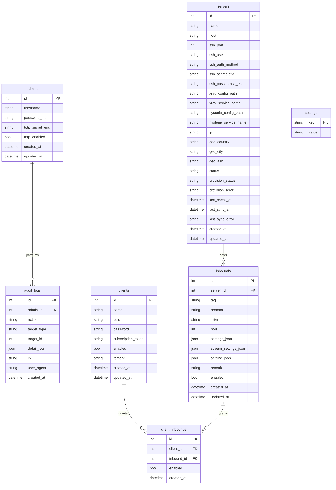

# ERD — модель данных

Диаграмма сущностей из `SPEC.md §4`. Протокол-специфичные параметры хранятся в
JSON-полях (`settings_json`, `stream_settings_json`, `sniffing_json`) — добавление
протокола (включая Hysteria2) не требует изменения схемы.

## Ключевые ограничения

- `client_inbounds`: уникальность `(client_id, inbound_id)`; `enabled` — точечное
  выключение доступа без удаления связи.
- `clients.subscription_token` — уникальный неугадываемый токен подписки.
- `clients.uuid` — для протоколов на UUID (VLESS/VMess); `clients.password` — для
  протоколов на пароле (Trojan/Shadowsocks/Hysteria2). Оба поля генерируются при
  создании клиента и стабильны.
- `inbounds.protocol` — строка; целевой движок определяется через реестр протоколов,
  а не отдельной колонкой.
- `settings` — key-value: домен/базовый URL подписки, интервал синхронизации, выбранный
  движок Hysteria2 и т.п.
- `servers.provision_status` (`pending`/`installing`/`installed`/`failed`) и `provision_error` —
  состояние автоустановки движков на ноду (SPEC §5.1). Server-level поля, добавлены аддитивной
  миграцией; sync не пушит на сервер, пока не `installed`.
