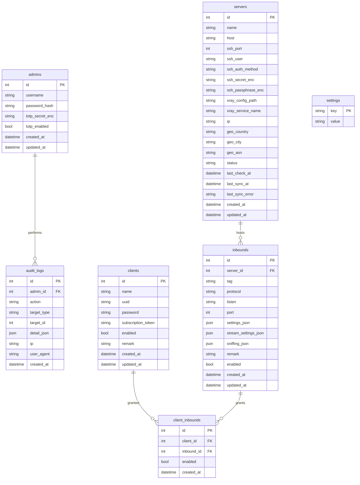

# SPEC — Панель управления Xray

Детальная спецификация проекта. Читается вместе с `CLAUDE.md` (правила работы) и
`docs/ROADMAP.md` (порядок реализации). Здесь — «что строим и почему», без порядка шагов.

---

## 1. Цель и границы

Панель для **личного** централизованного управления несколькими собственными VPS. На каждом VPS
установлен Xray, а на нодах с Hysteria2 — дополнительно движок Hysteria2 (`sing-box` или бинарник
`hysteria`). Одна панель на главном VPS управляет всеми экземплярами по SSH.

**В проекте НЕТ и не должно появиться:** биллинга, платежей, лимитов и учёта трафика по
клиентам, тарифов, рефералок, партнёрских и любых коммерческих функций, мультиарендности
(один админ).

**Ключевое отличие от «просто панели»:** клиент получает доступ **не к серверу целиком, а к
конкретным inbound-конфигурациям**. Один сервер может нести несколько inbound-ов разных типов
(и разных движков); подписка клиента автоматически собирается из всех разрешённых ему inbound-ов
на всех серверах.

**Протоколы MVP:** VLESS (Reality и TLS), VMess, Trojan, Shadowsocks — через xray-core; и
**Hysteria2 — обязателен** — через отдельный движок на ноде (см. §5).

---

## 2. Архитектура (высокоуровнево)

```
┌─────────────────────────────────────────────────────────────┐
│  Главный VPS                                                  │
│                                                              │
│  ┌────────────┐   HTTPS    ┌──────────────────────────────┐  │
│  │  Caddy     │──────────► │  Frontend (React SPA, static) │  │
│  │ (TLS,      │            └──────────────────────────────┘  │
│  │  reverse   │   /api/*   ┌──────────────────────────────┐  │
│  │  proxy)    │──────────► │  Backend (Go)                 │  │
│  │            │   /sub/*   │   ├─ REST API + Swagger        │  │
│  └────────────┘            │   ├─ Auth (bcrypt + TOTP)      │  │
│                            │   ├─ SSH-менеджер серверов     │  │
│        (опц.) движки ◄──────│   ├─ Реестр протоколов         │  │
│         на этом же VPS      │   ├─ Мультидвижковый sync      │  │
│                            │   └─ SQLite                    │  │
│                            └───────────────┬───────────────┘  │
└────────────────────────────────────────────┼─────────────────┘
                                     SSH      │
                        ┌─────────────────────┼─────────────────────┐
                        ▼                     ▼                     ▼
                 VPS #2                  VPS #3               ...любая нода
                 Xray                    Xray + Hysteria2      Xray и/или Hysteria2
```

**Как панель управляет нодами — основной механизм: SSH + управление файлами конфигов.**
Панель по SSH подключается к ноде и для **каждого движка**, задействованного на ней, генерирует
полный конфиг из inbound-ов этого движка и всех выданных на них клиентов, кладёт файл (с бэкапом
предыдущего), валидирует и перезапускает соответствующий сервис:
- **xray-core:** генерируется `config.json`, валидируется `xray -test -config …`, рестарт
  `systemctl restart <xray-service>` (или заданная команда).
- **Hysteria2 (sing-box / hysteria):** генерируется конфиг этого движка (JSON для sing-box или
  YAML для hysteria), валидируется проверкой конфига движка, рестарт его сервиса.

Один сервер может нести inbound-ы обоих движков одновременно — тогда пушатся и валидируются оба
конфига, рестартятся оба сервиса. Это надёжнее и проще, чем runtime-API, и напрямую покрывает
требования ТЗ («перезапуск через интерфейс», «CPU/RAM/диск через SSH»).

> *Опциональное улучшение на будущее:* горячее добавление пользователей без рестарта (gRPC
> HandlerService Xray; API sing-box). В MVP не делаем — полная регенерация конфига + рестарт.

---

## 3. Технологии

**Backend (Go):**
- HTTP-роутер: `chi` (лёгкий, stdlib-совместимый). GORM/gin — допустимая альтернатива, но по
  умолчанию идём на chi.
- Доступ к БД: `sqlc` (типобезопасные запросы) + миграции через `golang-migrate`. GORM допустим,
  если Claude Code обоснует в PROGRESS.md.
- SSH: `golang.org/x/crypto/ssh` (обязательно по ТЗ).
- TOTP: `github.com/pquerna/otp`. UUID: `github.com/google/uuid`. QR: `github.com/skip2/go-qrcode`.
- Хэши: `golang.org/x/crypto/bcrypt` (cost 12). Шифрование: stdlib `crypto/aes` + `crypto/cipher` (GCM).
- OpenAPI/Swagger: design-first `docs/openapi.yaml`, поддерживается в синхроне через `swaggo/swag`.

**Движки на нодах:**
- **xray-core** — для VLESS (Reality/TLS), VMess, Trojan, Shadowsocks. Конфиг — `config.json`.
- **Hysteria2** — движок на ноде: **`sing-box` (рекомендованный дефолт)** или референсный бинарник
  `hysteria`. Выбор фиксируется в `docs/ARCHITECTURE.md` (см. §5 и `QUESTIONS.md`). Backend
  генерирует конфиг выбранного движка (sing-box inbound JSON / hysteria YAML) и `hysteria2://` URI.
  При разработке движок Hysteria2 гоняется в локальной dockerized-ноде `test/hysteria-node`.

**Frontend (React + TypeScript):**
- Vite, React Router, TanStack Query (data-fetching/кэш).
- UI: Tailwind CSS + shadcn/ui (для «современного минималистичного» вида и тёмной/светлой темы).
  Mantine — допустимая альтернатива.
- Тема: dark/light через CSS-переменные, переключатель сохраняется (в БД настроек или локально).
- **Мок-фронт (Фаза 1)** собирается против мок-слоя (напр. MSW), реализующего тот же контракт
  `openapi.yaml`, что и реальный backend, — чтобы переключение с моков на API было минимальным.

**Хранилище:** SQLite (файл в volume). Схема и слой доступа спроектированы так, чтобы позже
можно было перейти на Postgres минимальными правками (без сырых SQLite-специфичных хаков в бизнес-логике).

**Развёртывание:** Docker Compose — сервисы `backend`, `frontend` (или статик через Caddy) и
`caddy` (TLS + reverse proxy). Один `docker compose up` поднимает всё локально; тот же compose
разворачивается на VPS в фазе деплоя (см. §13).

---

## 4. Модель данных

Протокол-специфичные параметры хранятся в **JSON-полях**, а не в отдельных колонках. Это и есть
механизм «добавить новый протокол без изменения схемы БД» — **включая Hysteria2**: его параметры
(порт, obfs, TLS-настройки и т.п.) живут в `settings_json`/`stream_settings_json` так же, как у
xray-протоколов. Отличается только целевой движок на ноде, а не схема БД.



**Пояснения:**

- **`inbounds`** — `protocol` это строка (`vless`/`vmess`/`trojan`/`shadowsocks`/`hysteria2`/…).
  Всё, что специфично для протокола/транспорта/безопасности (ключи Reality, `flow`, ALPN, SNI,
  path для ws/grpc; для Hysteria2 — obfs, up/down, TLS-настройки), живёт в `settings_json` /
  `stream_settings_json`. Добавление протокола не требует ALTER TABLE. Целевой движок inbound-а
  определяется его протоколом через реестр (§5), а не отдельной колонкой.
- **`servers`** — поля `xray_config_path`/`xray_service_name` обслуживают Xray-движок. Пути/имена
  сервисов для движка Hysteria2 задаются дефолтами реестра/движка и при необходимости переопределяются
  в `settings_json` inbound-а или в `settings` — **без изменения схемы**. `status`, `last_check_at`,
  `last_sync_at`, `last_sync_error` обслуживают дашборд и журнал синхронизаций. `ip/geo_*` кэшируются
  при проверке доступности.
- **`clients`** — генерим при создании: `uuid` (для протоколов на UUID: VLESS/VMess) и `password`
  (для протоколов на пароле: Trojan/Shadowsocks/**Hysteria2**). Оба поля стабильны и покрывают
  и нынешние, и будущие протоколы без изменения схемы. `subscription_token` — случайный неугадываемый
  токен для подписки.
- **`client_inbounds`** — junction «многие-ко-многим»: конкретный клиент допущен к конкретному
  inbound-у. `enabled` на уровне выдачи позволяет точечно выключать доступ. Уникальность
  `(client_id, inbound_id)`.
- **`settings`** — key-value: домен панели / базовый URL подписки, интервал синхронизации,
  выбранный движок Hysteria2 и т.п.

---

## 5. Расширяемость протоколов (реестр) и Hysteria2

Единственная точка, где живёт знание о протоколе, — Go-интерфейс + реестр. Поскольку теперь есть
**несколько целевых движков** (xray-core и Hysteria2), адаптер объявляет свой движок, а sync
раскладывает inbound-ы по движкам и собирает конфиг каждого.

```go
type Engine string

const (
    EngineXray     Engine = "xray"     // config.json для xray-core
    EngineHysteria Engine = "hysteria" // конфиг sing-box / hysteria на ноде
)

type Protocol interface {
    Name() string
    // Целевой движок, в конфиг которого попадёт этот inbound.
    Engine() Engine
    // Собрать фрагмент конфига для своего движка из inbound-а и выданных на него клиентов.
    BuildInbound(in Inbound, grants []ClientGrant) (json.RawMessage, error)
    // Собрать subscription-URI для одного клиента на этом inbound-е
    // (vless://…, trojan://…, hysteria2://… и т.д.).
    BuildLink(srv Server, in Inbound, c Client) (string, error)
}

// registry: map[string]Protocol. Регистрируем vless, vmess, trojan, shadowsocks (Engine=xray)
// и hysteria2 (Engine=hysteria). Добавить протокол = реализовать интерфейс + зарегистрировать.
// Миграций БД нет.
```

**MVP реализует:**

*Движок xray-core:*
- **VLESS + REALITY** (`flow=xtls-rprx-vision`) — основной, самый маскируемый.
- **VLESS + TLS** (ws/grpc/tcp+tls).
- **VMess**.
- **Trojan**.
- **Shadowsocks** (пример протокола на пароле).

*Движок Hysteria2 (обязателен):*
- **Hysteria2** — QUIC-протокол проекта Hysteria. **Его сервер не реализован в xray-core**, поэтому
  он не может быть inbound-ом в `config.json` Xray. Вместо этого на ноде работает отдельный движок:
  - **`sing-box` (рекомендованный дефолт):** Hysteria2 задаётся как inbound в JSON-конфиге sing-box.
    Плюс — единый JSON-формат, активная поддержка, один движок на будущие протоколы.
  - **бинарник `hysteria` (альтернатива):** референсная реализация, YAML-конфиг, узкоспециализирован.
  - Адаптер `hysteria2`: `Engine()=EngineHysteria`; `BuildInbound` возвращает фрагмент конфига
    выбранного движка (аутентификация по `password` клиента, TLS, при желании obfs); `BuildLink`
    возвращает `hysteria2://<password>@<host>:<port>/?sni=…&insecure=…#<remark>`.
  - Аутентификация Hysteria2 использует существующее поле `clients.password` — **новых колонок нет**.
  - **TLS обязателен для Hysteria2.** Стратегия фиксируется как решение (см. ниже и `QUESTIONS.md`):
    самоподписанный серт на ноде + `insecure=1` на клиенте (проще для личного использования) /
    реальный серт / ACME на ноде. Пути к сертам — node-side, задаются дефолтами движка или в
    `settings_json`/`settings`.

**Sync с несколькими движками.** Для ноды sync группирует её включённые inbound-ы по `Engine()`,
собирает конфиг каждого движка (`config.json` для Xray; конфиг sing-box/hysteria для Hysteria2),
пушит по SSH с бэкапом, валидирует каждый и рестартит соответствующий сервис. См. §6.

**Решения для `docs/QUESTIONS.md` (согласовать с человеком):**
1. Движок Hysteria2: `sing-box` (дефолт) vs бинарник `hysteria`.
2. Стратегия TLS для Hysteria2: самоподписанный + `insecure` / реальный серт / ACME на ноде.
3. Предполагается ли, что движок Hysteria2 уже установлен на нодах, или панель должна помогать с
   установкой (в MVP — считаем, что установлен; установка — вне SSH-конфиг-механизма).

---

## 6. Функционал

### 6.1 Серверы
Добавление/удаление; хранение SSH-подключения в БД (секрет зашифрован); проверка доступности;
определение статуса движков (Xray и, если есть, Hysteria2) на сервере; IP и геолокация; перезапуск
движка из интерфейса; снятие метрик CPU/RAM/диск по SSH.

### 6.2 Inbound-ы
CRUD inbound-ов в рамках сервера; выбор протокола и его параметров (форма подставляет разумные
дефолты, ключи Reality генерируются на бэкенде; для Hysteria2 — порт/obfs/TLS-настройки);
включение/выключение; при изменении — регенерация и пуш конфига **соответствующего движка** на сервер.

### 6.3 Клиенты
Создание одной кнопкой (генерация UUID, password и токена); переименование; удаление; отключение без
удаления (`enabled=false`); выдача/отзыв доступа к одному или нескольким inbound-ам (это и есть выбор
«на каких серверах/протоколах» живёт клиент, включая Hysteria2-inbound-ы).

### 6.4 Выдача конфигурации клиенту
После создания — готовая ссылка подключения, QR-код, скачивание конфиг-файла, кнопка «Обновить
конфигурацию» (ротация токена/пересборка). Пользователь ничего не настраивает вручную.

### 6.5 Механизм обновления конфигурации (подписка)
- У клиента — уникальный `subscription_token`.
- Публичный HTTPS-эндпоинт `GET /sub/{token}` отдаёт актуальную подписку: для каждого разрешённого
  и включённого inbound-а клиента на всех серверах генерируется URI (`vless://`, `vmess://`,
  `trojan://`, `ss://`, `hysteria2://`), список кодируется в base64 (стандартный формат подписки).
- Клиентское приложение (v2rayN/v2rayNG/NekoBox/sing-box/Streisand и пр., поддерживающее Hysteria2)
  периодически опрашивает URL → автообновление.
- При смене сервера/ключей/домена/маршрутов панель пересобирает — следующий опрос отдаёт свежий конфиг.
- Эндпоинт rate-limited; токен ротируется кнопкой «Обновить конфигурацию».

### 6.6 Sync-движок (мультидвижковый)
При любом изменении, влияющем на сервер (добавлен/изменён inbound, выдан/отозван доступ клиента,
клиент включён/выключен): для сервера собрать конфиг **каждого задействованного движка** → SSH:
бэкап текущего → записать новый → валидация (`xray -test` для Xray; проверка конфига для
sing-box/hysteria) → рестарт соответствующего сервиса → записать `last_sync_at`/результат.
Идемпотентно: сравнивать хэш по каждому движку, пустые пуши пропускать.

---

## 7. Безопасность

- Аутентификация админа: логин + пароль (**bcrypt**, cost 12), затем **TOTP** (2FA), если включён.
- Сессия: JWT короткоживущий + refresh, либо httpOnly-cookie сессия. Rate-limit на логин и `/sub`.
- **Секреты at-rest — AES-256-GCM**, мастер-ключ из `PANEL_ENCRYPTION_KEY` (32 байта, base64):
  SSH-ключ/пароль (`ssh_secret_enc`, `ssh_passphrase_enc`), TOTP-секрет (`totp_secret_enc`).
- **Данные деплоя** (IP VPS, SSH login/pass, домен) вводятся человеком в фазе деплоя, используются
  только в рамках сессии и **не пишутся в репозиторий/коммиты**.
- HTTPS обязателен — через Caddy (авто-Let's Encrypt) в compose либо сертификаты пользователя.
  Для Hysteria2 TLS — по выбранной стратегии (§5).
- **Все административные действия логируются** в `audit_logs` (кто, что, над чем, IP, время).
- Хостовые файлы движков на нодах трогаются только через фиксированные пути/команды.

---

## 8. Интерфейс

Страницы: **Login** (с шагом TOTP) · **Dashboard** (карточки серверов: online-статус, CPU/RAM/диск,
время последней синхронизации; сводные счётчики клиентов/серверов) · **Servers** (список + деталь
сервера с его inbound-ами всех протоколов включая Hysteria2, кнопки «проверить», «перезапустить») ·
**Clients** (список + деталь клиента: выдача доступа к inbound-ам чекбоксами, ссылка, QR, скачать,
обновить) · **Settings** (домен/базовый URL подписки, тема, 2FA) · **Logs** (журнал действий).
Тема тёмная/светлая. Стиль — современный минимализм.

> Порядок реализации UI: сначала **мок-фронт** (все страницы на мок-данных) для ревью человеком,
> затем те же страницы переключаются на реальный API. См. `docs/ROADMAP.md`.

---

## 9. Статистика (дашборд)
Количество клиентов; количество серверов; online-статус каждого сервера; CPU/RAM/диск на каждом
VPS (по SSH); время последней синхронизации (общее и по серверу).

---

## 10. REST API (основная поверхность)

Design-first: полный контракт — в `docs/openapi.yaml`, отражается в Swagger `/swagger`.

```
Auth
  POST   /api/auth/login              {username,password} -> {token | need_2fa}
  POST   /api/auth/2fa/verify         {code}
  POST   /api/auth/2fa/setup          -> {otpauth_url, qr}
  POST   /api/auth/2fa/enable         {code}
  POST   /api/auth/logout
  GET    /api/auth/me

Servers
  GET    /api/servers
  POST   /api/servers
  GET    /api/servers/{id}
  PUT    /api/servers/{id}
  DELETE /api/servers/{id}
  POST   /api/servers/{id}/check          # доступность + geo/ip + статус движков
  POST   /api/servers/{id}/restart-xray   # рестарт движка (Xray и/или Hysteria2)
  GET    /api/servers/{id}/stats          # CPU/RAM/диск по SSH

Inbounds
  GET    /api/servers/{id}/inbounds
  POST   /api/servers/{id}/inbounds
  GET    /api/inbounds/{id}
  PUT    /api/inbounds/{id}
  DELETE /api/inbounds/{id}

Clients
  GET    /api/clients
  POST   /api/clients
  GET    /api/clients/{id}
  PUT    /api/clients/{id}                 # переименование и т.п.
  DELETE /api/clients/{id}
  POST   /api/clients/{id}/enable
  POST   /api/clients/{id}/disable
  PUT    /api/clients/{id}/inbounds        # выдать/отозвать доступ (список inbound_id)
  POST   /api/clients/{id}/rotate-token    # «Обновить конфигурацию»
  GET    /api/clients/{id}/links           # готовые URI (включая hysteria2://)
  GET    /api/clients/{id}/qrcode
  GET    /api/clients/{id}/config          # скачать конфиг-файл

Subscription (публично, по токену)
  GET    /sub/{token}                      # base64-подписка из всех разрешённых inbound-ов

Прочее
  GET    /api/dashboard/summary
  GET    /api/logs
  GET    /api/settings
  PUT    /api/settings
  GET    /healthz
  GET    /readyz
  GET    /swagger/*
```

---

## 11. Структура репозитория (целевая)

```
xray-panel/
├── CLAUDE.md
├── README.md
├── docker-compose.yml
├── .env.example
├── .gitignore
├── .claude/
│   └── settings.json
├── docs/
│   ├── SPEC.md          # этот файл
│   ├── ROADMAP.md
│   ├── ARCHITECTURE.md  # создаётся в Фазе 0 (в т.ч. выбор движка Hysteria2)
│   ├── ERD.md           # mermaid, Фаза 0
│   ├── openapi.yaml     # контракт API (Фаза 0, до мок-фронта)
│   ├── PROGRESS.md      # журнал выполнения (ведёт Claude Code)
│   └── QUESTIONS.md     # блокеры/вопросы к человеку
├── backend/
│   ├── cmd/panel/main.go
│   ├── internal/
│   │   ├── config/      # чтение env, валидация
│   │   ├── crypto/      # aes-gcm, bcrypt
│   │   ├── db/          # подключение, sqlc-queries
│   │   ├── migrations/  # *.up.sql / *.down.sql
│   │   ├── auth/        # login, jwt/session, totp
│   │   ├── audit/       # запись действий
│   │   ├── ssh/         # клиент, exec, метрики (за интерфейсом → мокается)
│   │   ├── servers/
│   │   ├── inbounds/
│   │   ├── clients/
│   │   ├── protocols/   # registry + vless/vmess/trojan/shadowsocks (xray) + hysteria2 (sing-box/hysteria)
│   │   ├── sync/        # мультидвижковая сборка конфигов + пуш по SSH
│   │   ├── subscription/
│   │   ├── httpapi/     # router, handlers, middleware
│   │   └── logging/
│   ├── go.mod
│   └── Dockerfile
├── frontend/
│   ├── src/
│   │   ├── pages/        # Login, Dashboard, Servers, ServerDetail, Clients, ClientDetail, Settings, Logs
│   │   ├── components/
│   │   ├── api/          # клиент к REST + типы (из openapi.yaml)
│   │   ├── mocks/        # мок-слой для Фазы 1 (напр. MSW), реализует контракт openapi
│   │   ├── theme/        # dark/light
│   │   └── main.tsx
│   ├── package.json
│   ├── vite.config.ts
│   └── Dockerfile
├── deploy/
│   ├── Caddyfile
│   └── vps/             # скрипты/шаги деплоя на VPS по SSH (Фаза 8)
└── test/
    ├── integration/     # e2e против поднятого стека
    ├── xray-node/       # dockerized Xray-нода для локальной интеграции sync
    └── hysteria-node/   # dockerized Hysteria2-нода (sing-box/hysteria) для локальной интеграции sync
```

---

## 12. Тестирование

- **Backend:** `go test ./...`, table-driven. SSH — за интерфейсом, в юнит-тестах мок. Sync-движок
  интеграционно проверяется против **локальных dockerized-нод**:
  - `test/xray-node` — пушим `config.json`, ассертим, что `xray -test` его принимает;
  - `test/hysteria-node` — пушим конфиг движка Hysteria2, ассертим, что движок (sing-box/hysteria)
    принимает конфиг (проверка конфига).
- **Frontend:** vitest + testing-library. Мок-фронт (Фаза 1) тестируется против мок-слоя; после
  переключения на API — против реального backend. Опционально Playwright-smoke на собранном приложении.
- **Smoke целиком (локально):** `docker compose up` → curl `/healthz` → логин → создать сервер (мок) →
  создать клиента → выдать inbound (в т.ч. Hysteria2) → `GET /sub/{token}` возвращает непустую валидную
  подписку со всеми URI.

Реальный VPS в разработке/тестах не используется — панель разворачивается на него в фазе деплоя (§13).

---

## 13. Порядок реализации и деплой (кратко; детали — в ROADMAP)

Порядок задан человеком и обязателен:

1. **Мок-фронт → ревью.** Сначала полный frontend на моках (без backend), человек смотрит и правит UI/UX.
2. **Backend + локальный запуск.** После одобрения фронта — полноценный backend, фронт переключается
   с моков на реальный API, всё поднимается локально (`docker compose up`).
3. **Деплой на VPS → ревью.** Claude Code запрашивает у человека IP VPS, SSH login/pass и домен, по SSH
   разворачивает панель на VPS, проверяет работу по HTTPS. Данные деплоя — только в рамках сессии, не
   коммитятся. Человек убеждается, что панель работает на его VPS.
4. **Git.** Только после этого — `git push` (с разрешения человека). До этого — только локальные коммиты.

Что остаётся за человеком: заполнение `.env`, передача данных деплоя в фазе деплоя, DNS/домен на VPS,
выбор движка и TLS-стратегии для Hysteria2, разрешение на `git push` и финальное ревью.
